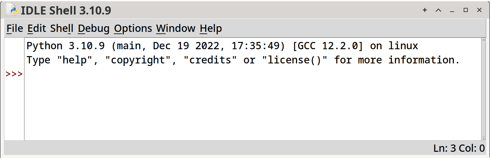

<!--
vim: ts=4:sw=4:nosi:et:tw=72:spell:nojs
-->

# What software will I need?

## Objectives

* Install Python, and explain what it does
* Learn what an _Integrated Development Environment_ (IDE) is.

## What Is All This?

Python is a _programming language_. It interprets instructions that you,
the programmer, give it, and it executes them. Think of it like a robot
you can give a series of commands to ahead of time, and then have it run
off and do them on its own.

In programmer parlance, we call these sets of instructions _code_.

In addition to being a programming language, Python is also a program,
itself! It's a program that runs other programs! We don't have to worry
about the details of that at all, except that since Python is a program,
it's something we'll have to install on our computers.

> Python comes in different versions. The big versions are 2 and 3.
> We'll be using Python 3 for everything in this book. Python 2 is
> older, and is rarely used in new projects.

Python also comes with an _Integrated Development Environment_, or IDE.
An IDE is a program that helps you write, run, and debug (remove the
errors from) code.

It's main components are:

* The _editor_. This is like a word processor except specifically
  designed for use with code.

* The _debugger_. This helps you step through your code a line at a time
  and watch the data values change as you go. It can help you find
  places where your code is incorrect.

* The _console_ or _terminal_. This is a window where the output from
  your program appears (and where you might type input to the program).

The name of Python's built-in IDE is _IDLE_. There are other IDEs we'll
talk about later.

## Installing Python

### Windows

There are two ways to do this:

* Install from the Microsoft Store
* Install from the official website

I can't see any disadvantage to installing it from the store. Just
remember to install Python 3 (not Python 2).

If you install it from the [fl[official
website|https://www.python.org/downloads/]], you need to remember to
check the "Add to PATH" box during the install procedure!

Another option to installing Python on Windows is through WSL. We'll
cover this later.

### Mac

Download and install Python for Mac from the [fl[official
website|https://www.python.org/downloads/]].

Another option to installing Python on Mac is through Homebrew. We'll
cover this later.

### Linux/Unix-likes

The Linux community tends to be pretty supportive of people looking to
install things. Google for something like `ubuntu install python3`,
replacing `ubuntu` with the name of your distribution.


## Running IDLE

Here's where we get to run the IDE for the first time. First we'll look
at how to do it on various platforms, and then we'll run some Python
code in it.

Running IDLE depends on the platform:

|Platform|Commands|
|--------|------------------------------------------------------------|
|Windows|Hit the Start menu and type "idle". It should show up in the pick list and you can click to open it.|
|Mac|Hit CMD-SPACE and type "idle". It should show up in the pick list and you can click to open it.|
|Unix-like|Type `idle` in the terminal or find it in your desktop pulldown menu.|

If you get an error, cut and paste that error into your favorite search
engine to see what other people say about how to solve it.

Once IDLE is up, you should see a window that looks vaguely like this:



## Your First Command

In the IDLE window after the `>>>` prompt, type:

```python
print("Hello, world!")
```

and hit `RETURN`. This commands Python to output the words "Hello,
world!".

```python
>>> print("Hello, world!")
    Hello, world!
```

And it did!

This is just the beginning!

## Summary

* The integrated development environment (IDE) has an editor, a
  debugger, and a terminal window.
* The code editor in the IDE is where you'll be typing your programs.
* The programs, also known as _code_, are a series of instructions that
  Python will execute.
* Python is a program that will run your Python programs!

